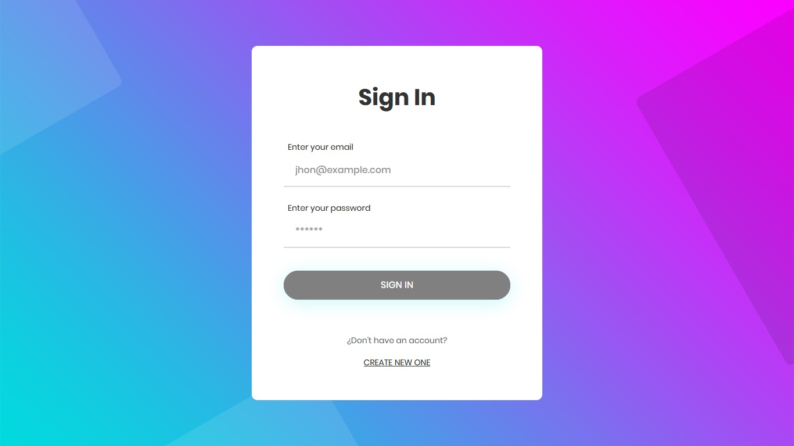
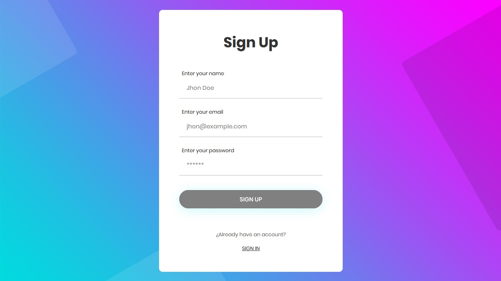
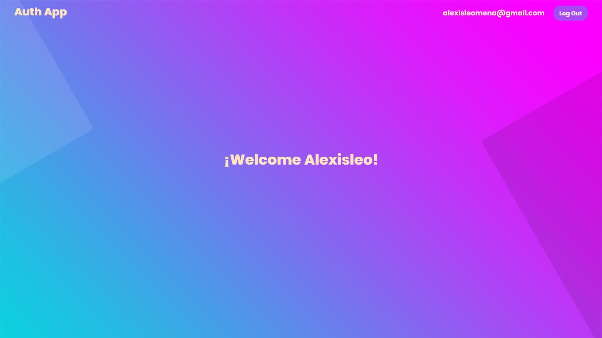

# AuthApp

Esta es una aplicación sencilla de inicio de sesión construida con Angular 16 y que consume recursos de una [aplicación backend](https://github.com/AlexisleoMena/API-Auth-MEAN-Nest) creada con Nest. La aplicación utiliza Docker con Nginx como servidor web y también integra la autenticación JWT para proporcionar una experiencia segura.

## Capturas de Pantalla

Algunas capturas de pantalla de la aplicación:

__Inicio de Sesión:__


__Registro:__


__Panel de Control:__


## Cómo Iniciar la Aplicación
Sigue estos pasos para iniciar la aplicación en tu entorno local:

1. Clona este repositorio en tu máquina local:
```bash
  git clone https://github.com/AlexisleoMena/APP-Auth-MEAN-Angular.git
  cd auth-app
```

2. Instala las dependencias de la aplicación utilizando npm:
```bash
  npm install
```
3. Inicia la aplicación en modo de desarrollo:
```bash
  npm start
```

4. Abre tu navegador y visita http://localhost:4200 para acceder a la aplicación.

## Cómo Crear una Imagen y Ejecutar el Contenedor
Si deseas desplegar la aplicación utilizando Docker, aquí tienes los pasos necesarios:

1. Asegúrate de tener Docker instalado en tu máquina.

2. Abre una terminal y navega hasta la raíz del proyecto.

3. Crea la imagen de docker:
```bash
docker build --no-cache --progress=plain -t ang-app .
```

4. Inicia o ejecuta el contenedor creado:
```bash
docker run -d -it -p 80:80/tcp ang-app
```
Con estos pasos, tendrás la aplicación AuthApp funcionando en un contenedor Docker.
